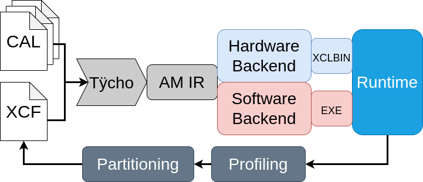

StreamBlocks Platforms Repository
=================================

Welcome to the StreamBlocks Platforms repository. This repository contains the
code generators for the StreamBlocks dataflow compiler. If you are using
StreamBlocks for the first time, this is the readme you need to follow to get a
sense of the overall workflow and the different tools used within StreamBlocks.


StreamBlocks compiler provides a unified compilation framework for CPU-FPGA
platforms. The figure below shows the compiler flow in full.



StreamBlock transpiles dataflow programs written in CAL to C++ for
multicore + FPGA platforms. Tycho is the frontend that takes CAL and produces
and internal representation called the Actor Machine IR. Tycho's code is found
in the [streamblocks-tycho](https://github.com/streamblocks/streamblocks-tycho)
repositry.

The two hardware and software backends generate heterogeneous C++ code for
execution. The code generators along with the runtime are part of the
[streamblocks-platform](https://github.com/streamblocks/streamblocks-platforms)
repository (i.e., this one!).

The partitioning tool is yet another repository, not surprisingly called
[streamblocks-partitioning](https://github.com/streamblocks/streamblocks-partitioning).


The first two repositories are essential for code generation and execution. The
last one is for design space exploration.
[streamblocks-partitioning](https://github.com/streamblocks/streamblocks-partitioning)
uses profiling information obtained from either simulation or real execution
to suggest pseudo-optimal hardware-software partitions.

This readme only walk you through setting up the first two repositories. A
tutorial on setting up the partitioning is found in the corresponding
[streamblocks-partitioning](https://github.com/streamblocks/streamblocks-partitioning)
repository. There is a 4th
[streamblocks-examples](https://github.com/streamblocks/streamblocks-examples)
repository with a good number CAL programs.


The rest of this guide is organized as follows:

1. The compiler basics
2. Basic setup and dependencies
3. Compiling a simple example

# 1. The compiler basics
----------------------------

The StreamBlocks dataflow compiler offers code-generation for multicore generic
platforms and FPGAs through High-level synthesis. This repository contains the
backends of the StreamBlocks-tycho dataflow frontend compiler.

To use the StreamBlocks platforms first you need to compile and install
StreamBlocks-Tycho compiler
[streamblocks-tycho](https://github.com/streamblocks/streamblocks-tycho/blob/master/README.md).
We will go through installation in the next step.

The Tycho frontend does not get too far, it can generate some basic C code that
is then compiled down to single-thread binaries for software execution but we
never use that. Rather, we use Tycho's internal representation of an Actor
network to generate _heterogeneous_ C++ code.

This is where the current repository comes into play. Since we are targeting
heterogeneous execution, we need to generate code for both software and hardware
execution. We do this through __platforms__ or basically different code generators
or backends.
You can find a brief description of each platform below:

Platform                   | Description           |
---------------------------|-----------------------|
[platform-generic-c/][]    | Generic monocore C code generation <i> (deprecated, found in tycho)</i>  <br> |
[platform-multicore/][]    | Code generation for multi-threaded software execution <br> |
[platform-vivadohls/][]    | Code generation for Xilinx FPGAs by using Vivado HLS, SDAccel & Vitis <br> |
[platform-node/][]         | Code generation for multicore and multi-node execution, incomplete and experimental <br> |
[platform-orcc/][]         | Unused code software code generator based on the Orcc compiler <br> |
[platform-core/][]         | Basic utilities used by all the other platforms, does not really generate code <br> |

We basically just need to understand what `platform-vivadohls` and
`platform-multicore` do. Each take a (part of) dataflow program and generate HLS
or software C++ respectively. They could while `platform-multicore` can be used
completely independently but `platform-vivadohls` is not standalone. This is
because any HLS code needs some software code that feeds it data and intercepts
its output.

# 2. Basic setup and dependencies
-----------------------------------

## Dependencies
* StreamBlocks platforms are written with Java 8, you will need a compatible Java SE Development Kit 8 (or later), Apache Maven and Git.


* The generated C multithreaded source code of StreamBlocks has the following dependencies: CMake, libxml2 and (optionaly) libsdl2.


* The generated C++ for Vivado HLS source code of StreamBlocks, needs the [Xilinx Vivado Design Suite](https://www.xilinx.com/products/design-tools/vivado.html). You also need xilinx run time or `XRT`
installed with the FPGA platforms you want to use.


## Setup

Once you have all the dependencies set up. Create a directory called `streamblocks` somewhere in your system and go to that directory.

```bash
> mkdir streamblocks
> cd streamblocks
```

Clone [streamblocks-tycho](https://github.com/streamblocks/streamblocks-tycho)
and install it using maven (this will install some jar files somewhere in your
home directory which is picked up by `streamblocks-platforms`).

```bash
> git clone https://github.com/streamblocks/streamblocks-tycho
> cd streamblocks-tycho &&  mvn install -DskipTests && cd ..
```

Maven should succeed, then clone this repository and install it using maven.

```bash
> git clone https://github.com/streamblocks/streamblocks-platforms
> cd streamblocks-platforms &&  mvn install
```

# 3. Running a simple example
--------------------------------

In the `streamblocks-platforms` directory running `streamblocks --help` should
welcome you with some basic command line options. We will first go through the
software execution flow and then we will give you a tour of how you can compile
code for heterogeneous platforms (slightly more complicated). This guide does
not cover automatic partitioning methodology though, for that refer to the
[streamblocks-partitioning](https://github.com/streamblocks/streamblocks-partitioning)
repository.


## Software execution

To actually execute something, let's write a simple CAL program:

``` bash
> echo '
namespace hetero.simple:
  actor Source(int payload_size) ==> int Out:
    int counter := 0;
    transmit: action ==> Out:[t]
    guard counter < payload_size
    var t = counter
    do
      println("Tx: " + t);
      counter := counter + 1;
    end
  end

  actor Sink() int In ==>:
    action In:[t] ==>
    do
        println("Rx: " + t);
    end
  end

  actor Pass() int In ==> int Out:
    action In:[t] ==> Out:[t]
    end
  end

  network PassThrough() ==> :
  entities
    source = Source(payload_size = 20);
    pass  = Pass() { partition = "hw"; };
    sink = Sink();
  structure
    source.Out --> pass.In { bufferSize = 1; };
    pass.Out --> sink.In { bufferSize = 1; } ;
  end

end' > simple.cal


```

You can compile this program program using:
```bash
> ./streamblocks multicore --source-path simple.cal --target-path myproject hetero.simple.PassThrough
```

Note that we have to specify the source files, an output directory, and the name
of the top network (which does not have any inputs or outputs) to the compiler.
Once `streamblocks` finishes successfully, you see a new directory `myproject` with the
following structure:
```
myproject
├── bin
│   ├── configuration.xcf
│   ├── PassThrough.py
│   ├── PassThrough.script
│   └── streamblocks.py
├── build
├── CMakeLists.txt
├── code-gen
│   ├── auxiliary
│   ├── CMakeLists.txt
│   ├── include
│   └── src
└── lib
    ├── art-genomic
    ├── art-native
    ├── art-node
    ├── art-runtime
    ├── cmake
    └── CMakeLists.txt
```
This directory does not contain any executable. The`bin` does not contain the
final executable at this point, the python are not currently used generated
nonetheless and you should just ignore them. To get an executable, we should
compile the generated C++ files down to binary, this is done quite simply:
```
> cd myproject/build # if myproject/build does not exist create it
> cmake ..
> cmake --build .
```
This will create an executable `bin/PassThrough`:
```
> cd ../bin
> ./PassThrough
Tx: 0
Tx: 1
Rx: 0
Tx: 2
Rx: 1
Tx: 3
Rx: 2
Tx: 4
Rx: 3
Tx: 5
Rx: 4
Tx: 6
Rx: 5
Tx: 7
...
```
Note that here we used a single thread to execute the three actors in software.
Using multiple threads is quite simple, you need a configuration file to specify
the actor to thread mapping. The `PassThrough` executable can generate this file,
and you can then simply modify it:
```
> ./PassThrough --generate=threads.xml
```
Or you can write it yourself (e.g., use one thread per actor):
```xml
<?xml version="1.0" encoding="UTF-8"?>
<configuration>
	<partitioning>
		<partition id="0" scheduling="ROUND_ROBIN">
			<instance id="source"/>
        </partition>
        <partition id="1" scheduling="ROUND_ROBIN">
			<instance id="pass"/>
        </partition>
        <partition id="2" scheduling="ROUND_ROBIN">
			<instance id="sink"/>
		</partition>
	</partitioning>
</configuration>

```
And use for multi-thread execution:
```
> ./PassThrough --cfile=threads.xml
```


## Heterogeneous execution

For heterogeneous code we have to call the compiler twice with an extra `--set partitioning=on` argument:

```bash
> ./streamblocks multicore --source-path simple.cal --target-path myproject --set partitioning=on hetero.simple.PassThrough
> ./streamblocks vivado-hls --source-path simple.cal --target-path myproject --set partitioning=on hetero.simple.PassThrough
```

Note that the two commands above merely generate C++ code for hardware and
software. Like the software-only flow, we have to further build the FPGA and
host binaries using `cmake`.

Here is an example of generated directories:

```
myproject
├── CMakeLists.txt
├── multicore
│   ├── bin
│   ├── build
│   ├── CMakeLists.txt
│   ├── code-gen
│   │   ├── auxiliary
│   │   ├── CMakeLists.txt
│   │   ├── include
│   │   └── src
│   └── lib
│       ├── art-genomic
│       ├── art-native
│       ├── art-node
│       ├── art-plink
│       ├── art-runtime
│       ├── cmake
│       └── CMakeLists.txt
└── vivado-hls
    ├── bin
    │   ├── xclbin
    │   └── xrt.ini
    ├── build
    ├── cmake
    │   ├── FindSDAccel.cmake
    │   ├── FindVitis.cmake
    │   ├── FindVitisHLS.cmake
    │   ├── FindVivado.cmake
    │   ├── FindVivadoHLS.cmake
    │   ├── FindXRT.cmake
    │   └── Helper.cmake
    ├── CMakeLists.txt
    ├── code-gen
    │   ├── auxiliary
    │   ├── host
    │   ├── include
    │   ├── include-tb
    │   ├── rtl
    │   ├── rtl-tb
    │   ├── src
    │   ├── src-tb
    │   ├── tcl
    │   ├── wcfg
    │   └── xdc
    ├── output
    │   ├── fifo-traces
    │   └── kernel
    ├── scripts
    └── systemc
        ├── include
        └── src
```
In these rather large directory of files, what matters is the top-level
`CMakeLists.txt` files which can be used to build a heterogeneous executable.

To build hardware targets, you need to have a working Vitis and Vivaod HLS
installation. Ideally use the 2019.2 versions (newer versions may work but have
not been really tested). Vitits is installed in `${VITIS_DIR}` you can make it
available in the `${PATH}` by:
```
source ${VITIS_DIR}/settings64.sh
```
You also need to have `${XILINX_XRT}` set to where `XRT` is installed, e.g.,
and some `XRT` utility binaries available in the `$PATH`. This can be done
by (assuming `XRT` is installed in `/opt/xilinx/xrt/`):

```
bash /opt/xilinx/xrt/setup.sh
```

With these environment variables set, you can proceed to building an FPGA binary

``` bash
> mkdir -p myproject/build
> cd myproject/build
> cmake .. -DHLS_CLOCK_PERIOD=3.3 -DFPGA_NAME=xcu250-figd2104-2L-e -DPLATFORM=xilinx_u250_xdma_201830_2 -DUSE_VITIS=on
> cmake --build . --target PassThrough_kernel_xclbin
```
This can take several hours. To get a simulation binary instead you can use
`-DTARGET=hw_emu` to use the hardware emulation mode in which the hardware
execution is simulated in software (see hardware emulation mode in Vitis). This
results in a faster compilation time but orders of magnitude slower execution
time.

Likewise, you can build the software binary by
```
> cmake --build . --target PassThrough
```

Once both targets are ready, you can execute the program:
```
> cd ../bin
> ./PassThrough
```


Note that this rather tedious flow can be easily scripted. We plan to streamline
compilation in the future by integrating all the steps in one place. But for now
consider writing your own scripts. You can checkout the `streamblocks-example`
repository to ge inspired by how you can use `cmake` to fully automate the
process.

### cmake version issues

It's possible that you get a "cmake minimum version" error. This happens because
xilinx tools override your predefined cmake binary with one of their own. Simply
install a newer version locally on your system say `${CMAKE_HOME}` and do the following
after initializing Xilinx tools:

```bash
alias cmake = ${CMAKE_HOME}/bin/cmake
```

We will hopefully fix this issue later.


[.]:.
[platform-generic-c/]:platform-multicore/
[platform-multicore/]:platform-multicore/
[platform-vivadohls/]:platform-vivadohls/
[platform-node/]:platform-node/
[platform-orcc/]:platform-orcc/
[platform-core/]:platform-core/
